# EJERCICIO 1
## A. Escriba una consulta que muestre, por cada orden de pay.orders, el nombre del cliente (cs.customers), el order_id, la order_date y un campo nro_orden que numere cronológicamente las órdenes de cada cliente, comenzando en 1. Use PARTITION BY customer_id_number y ORDER BY order_date ASC, id ASC como desempate.
``` sql 
SELECT
    T2.name,
    T1.id AS order_id,
    T1.order_date,
    ROW_NUMBER() OVER (
        PARTITION BY T1.customer_id_number
        ORDER BY T1.order_date ASC, T1.id ASC
    ) AS nro_orden
FROM pay.orders T1
INNER JOIN cs.customers T2
    ON T1.customer_id_number = T2.id_number;
```
### **SCREENSHOT**
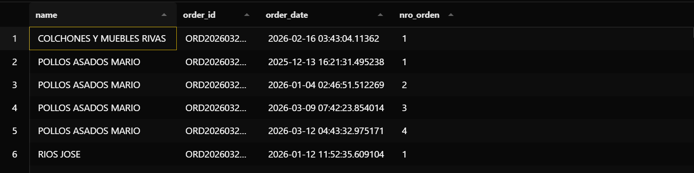

## B. A partir de la consulta anterior, envuélvala en una CTE y filtre únicamente las filas donde nro_orden = 1. El resultado debe contener exactamente una fila por cliente con su primera orden. Documente cuántos clientes tienen al menos una orden registrada.
```sql 
WITH historial_ordenes AS (
    SELECT
        T2.name,
        T1.id AS order_id,
        T1.order_date,
        T1.customer_id_number,
        ROW_NUMBER() OVER (
            PARTITION BY T1.customer_id_number
            ORDER BY T1.order_date ASC, T1.id ASC
        ) AS nro_orden
    FROM pay.orders T1
    INNER JOIN cs.customers T2
        ON T1.customer_id_number = T2.id_number
)
SELECT
    name,
    order_id,
    order_date
FROM historial_ordenes
WHERE nro_orden = 1;

```
### **SCREENSHOT**
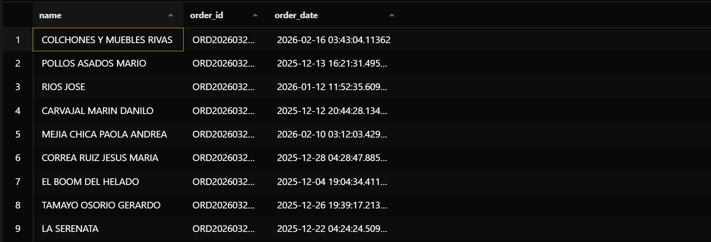
``` sql
WITH historial_ordenes AS (
    SELECT
        T1.customer_id_number,
        ROW_NUMBER() OVER (
            PARTITION BY T1.customer_id_number
            ORDER BY T1.order_date ASC, T1.id ASC
        ) AS nro_orden
    FROM pay.orders T1
)
SELECT COUNT(*) AS clientes_con_orden
FROM historial_ordenes
WHERE nro_orden = 1;
```
### **SCREENSHOT**
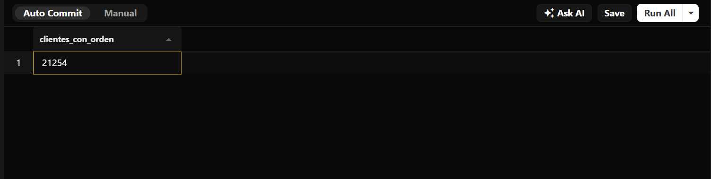

## **Análisis escrito:** Explique con sus propias palabras por qué el filtro ```WHERE nro_orden = 1``` debe ir fuera de la consulta principal que contiene el ```ROW_NUMBER```, es decir, en una CTE o subconsulta. ¿Qué error produciría intentarlo directamente en el WHERE de la misma consulta?

> Porque la CTE funciona como una primera etapa, es decir, primero numeramos las órdenes y luego filtramos esa numeración. El ```WHERE``` de la consulta externa puede utilizar nro_orden porque para ese momento la columna ya fue creada por la CTE.

# EJERCICIO 2
## A. Escriba una consulta sobre ship.shipment_orders y ship.ship_company que muestre: nombre de la empresa, total de órdenes despachadas, rank_normal con RANK() y rank_dense con DENSE_RANK(), ambos ordenados por total de envíos descendente.

```sql
SELECT
    T2.name,
    COUNT(T1.order_id) AS total_orders,
    RANK() OVER (
        ORDER BY COUNT(T1.order_id) DESC
    ) AS rank_normal,
    DENSE_RANK() OVER (
        ORDER BY COUNT(T1.order_id) DESC
    ) AS rank_dense
FROM ship.shipment_orders T1
INNER JOIN ship.ship_company T2
    ON T1.ship_company_id = T2.id
GROUP BY T2.id, T2.name
ORDER BY total_orders DESC;

```
### **SCREENSHOT**
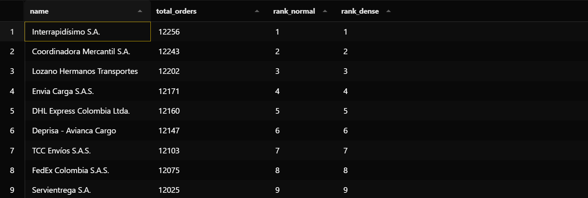

## B.  Identifique en su resultado cuántas empresas empataron en algún puesto. Documente el puesto donde ocurrió el empate, el número que asignó ``RANK()`` a la empresa siguiente y el número que asignó ``DENSE_RANK()``.
> No se presentaron empates entre las empresas de envío. Cada empresa obtuvo un volumen diferente de órdenes, por lo que ``RANK()`` y ``DENSE_RANK()`` asignaron exactamente el mismo puesto a cada empresa. No existe ningún puesto con empate, por lo que tampoco se presenta un salto de posición en RANK(). Por ejemplo, los puestos aparecen consecutivamente: 1, 2, 3, 4, 5, etc.

## C. Modifique la consulta para incluir además el porcentaje que representa cada empresa sobre el total general de envíos, usando   ``SUM(COUNT(*)) OVER ()`` como denominador. Nombre esta columna ``pct_of_total``.

```sql
SELECT
    T2.name,
    COUNT(*) AS total_orders,
    RANK() OVER (
        ORDER BY COUNT(*) DESC
    ) AS rank_normal,
    DENSE_RANK() OVER (
        ORDER BY COUNT(*) DESC
    ) AS rank_dense,
    COUNT(*) * 100.0 / SUM(COUNT(*)) OVER () AS pct_of_total
FROM ship.shipment_orders T1
INNER JOIN ship.ship_company T2
    ON T1.ship_company_id = T2.id
GROUP BY T2.id, T2.name
ORDER BY total_orders DESC;
```
### **SCREENSHOT**
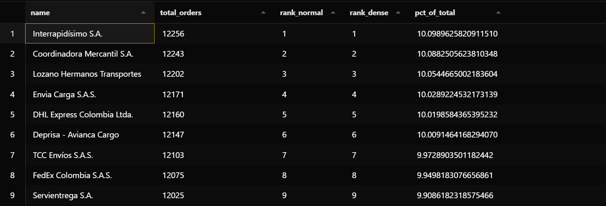

## **Análisis escrito:** ¿En qué escenario de negocio preferiría usar ``RANK()`` sobre ``DENSE_RANK()`` y viceversa? Justifique con un ejemplo concreto de este esquema
> Usaría ``RANK()`` cuando me interese mostrar una posición real y que los empates tengan un efecto en las posiciones siguientes. Por ejemplo, en ``ship.shipment_orders`` podría utilizarlo para hacer un ranking de las empresas de envío según la cantidad de órdenes que han manejado. Si dos empresas quedan en el puesto 3, las dos serían 3 y la siguiente aparecería en el puesto 5, dejando claro que hubo dos empresas antes con la misma posición.

> Usaría ``DENSE_RANK()`` cuando me interese agrupar los resultados por nivel de rendimiento, sin que los empates hagan que se salten posiciones. Por ejemplo, si quiero clasificar las empresas de envío en niveles según la cantidad de órdenes que manejan, podría tener nivel 1, nivel 2, nivel 3, etc. Si dos empresas están en el nivel 3, la siguiente seguiría siendo nivel 4.

# EJERCICIO 3
## A. Escriba una consulta sobre pay.order_items y ctg.products que muestre por producto: product_name, total_revenue_cop (suma de cop_price * quantity), grand_total total de todos los productos usando SUM(SUM(...)) OVER () y pct_of_total redondeado a 2 decimales. Ordene de mayor a menor por total_revenue_cop

```sql
SELECT
    T2.name AS product_name,
    SUM(T2.cop_price * T1.quantity) AS total_revenue_cop,
    SUM(SUM(T2.cop_price * T1.quantity)) OVER () AS grand_total,
    ROUND(
        SUM(T2.cop_price * T1.quantity) * 100.0
        / SUM(SUM(T2.cop_price * T1.quantity)) OVER (),
        2
    ) AS pct_of_total
FROM pay.order_items T1
INNER JOIN ctg.products T2
    ON T1.product_id = T2.id
GROUP BY T2.id, T2.name
ORDER BY total_revenue_cop DESC;
```
### **SCREENSHOT**
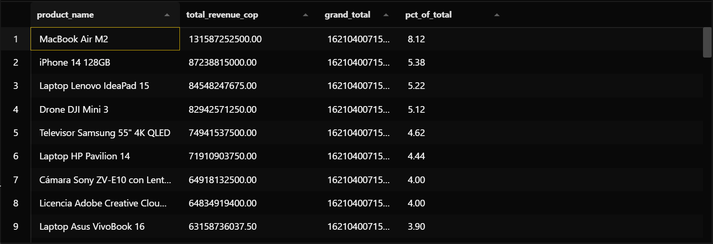

## B. Verifique que la columna grand_total es idéntica en todas las filas. Documente ese valor exacto y explique en el Markdown por qué sucede esto.

> La columna ``grand_total`` tiene exactamente el mismo valor en todas las filas. Esto sucede porque ``SUM(SUM(...)) OVER ()`` calcula la suma total de los ingresos de todos los productos, sin realizar ninguna partición. Por eso, ese mismo total general se muestra repetido en cada fila. Mientras que ``total_revenue_cop`` cambia según el producto, ``grand_total`` siempre representa el ingreso total de todos los productos.

## C. Modifique la consulta para calcular también el porcentaje acumulado: cada fila debe mostrar el porcentaje que representa ese producto más todos los anteriores (los de mayor ingreso). Use ``SUM(SUM(...)) OVER (ORDER BY SUM(...) DESC)`` para lograrlo. Nombre esta columna ``cumulative_pct``.

``` sql
SELECT
    T2.name AS product_name,
    SUM(T2.cop_price * T1.quantity) AS total_revenue_cop,
    SUM(SUM(T2.cop_price * T1.quantity)) OVER () AS grand_total,
    ROUND(
        SUM(T2.cop_price * T1.quantity) * 100.0
        / SUM(SUM(T2.cop_price * T1.quantity)) OVER (),
        2
    ) AS pct_of_total,
    ROUND(
        SUM(SUM(T2.cop_price * T1.quantity)) OVER (
            ORDER BY SUM(T2.cop_price * T1.quantity) DESC
        ) * 100.0
        / SUM(SUM(T2.cop_price * T1.quantity)) OVER (),
        2
    ) AS cumulative_pct
FROM pay.order_items T1
INNER JOIN ctg.products T2
    ON T1.product_id = T2.id
GROUP BY T2.id, T2.name
ORDER BY total_revenue_cop DESC;
```
### **SCREENSHOT**
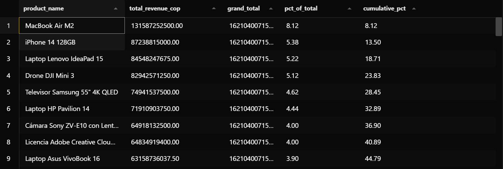

# EJERCICIO 4
## A. Construya una CTE llamada ``monthly_sales`` que agrupe ``pay.orders`` por mes ``(DATE_TRUNC(’month’, order_date))`` y calcule la suma de total por mes. Sobre esa CTE escriba una consulta que agregue la columna ``cumulative_revenue`` usando ``SUM(monthly_revenue) OVER (ORDER BY month ASC)``.

```sql
WITH monthly_sales AS (
    SELECT
        DATE_TRUNC('month', T1.order_date) AS month,
        SUM(T1.total) AS monthly_revenue
    FROM pay.orders T1
    GROUP BY DATE_TRUNC('month', T1.order_date)
)
SELECT
    month,
    monthly_revenue,
    SUM(monthly_revenue) OVER (
        ORDER BY month ASC
    ) AS cumulative_revenue
FROM monthly_sales
ORDER BY month ASC;
```
### **SCREENSHOT**
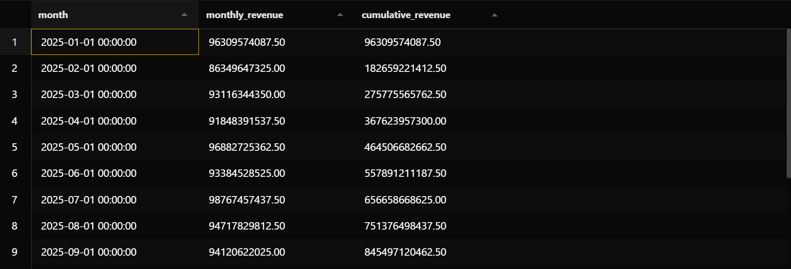

## B. Agregue a la misma consulta una columna pct_of_total que muestre qué porcentaje del ingreso total acumulado representa cada mes, usando ``SUM(...) OVER ()`` como denominador global.
``` sql
WITH monthly_sales AS (
    SELECT
        DATE_TRUNC('month', T1.order_date) AS month,
        SUM(T1.total) AS monthly_revenue
    FROM pay.orders T1
    GROUP BY DATE_TRUNC('month', T1.order_date)
)
SELECT
    month,
    monthly_revenue,
    SUM(monthly_revenue) OVER (
        ORDER BY month ASC
    ) AS cumulative_revenue,
    ROUND(
        SUM(monthly_revenue) OVER (
            ORDER BY month ASC
        ) * 100.0
        / SUM(monthly_revenue) OVER (),
        2
    ) AS pct_of_total
FROM monthly_sales
ORDER BY month ASC;
```
### **SCREENSHOT**
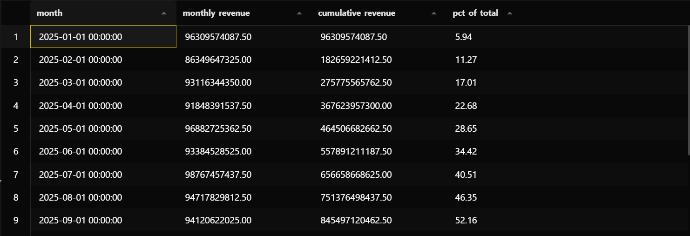

## **Análisis escrito y diagrama:** dibuje a mano o en cualquier herramienta digital una tabla con al menos 4 filas de resultado (puede usar valores ficticios) y trace una flecha entre cada fila mostrando cómo el acumulado de la fila n se convierte en la base del acumulado de la fila n + 1. Inserte la imagen en el Markdown.

### **SCREENSHOT**
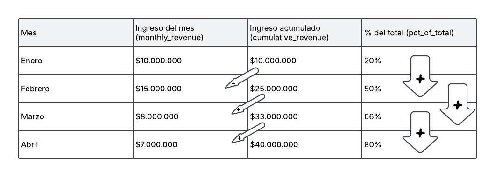
> En la primera fila se inicia con su propio valor (el ingreso del mes): ``ENERO = 10.000.000``  
> En la segunda fila suma su mes al acumulado anterior: ``10.000.000 + 15.000.000 = 25.000.000``  
> En la tercera fila suma su valor al acumulado anterior: ``25.000.000 + 8.000.000 = 33.000.000``  
> En la cuarta fila suma su valor al acumulado anterior: `` 7.000.000 + 33.000.000 = 40.000.000``

## D. **Experimento:** modifique la consulta del literal (a): agregando ``PARTITION BY`` por el campo de método de pago ``(payment_method_id)``. Documente qué cambia en el resultado y explique por qué el acumulado ahora reinicia
```sql 
WITH monthly_sales AS (
    SELECT
        DATE_TRUNC('month', T1.order_date) AS month,
        T1.payment_method_id,
        SUM(T1.total) AS monthly_revenue
    FROM pay.orders T1
    GROUP BY
        DATE_TRUNC('month', T1.order_date),
        T1.payment_method_id
)
SELECT
    month,
    payment_method_id,
    monthly_revenue,
    SUM(monthly_revenue) OVER (
        PARTITION BY payment_method_id
        ORDER BY month ASC
    ) AS cumulative_revenue
FROM monthly_sales
ORDER BY payment_method_id, month ASC;
```
### **SCREENSHOT**
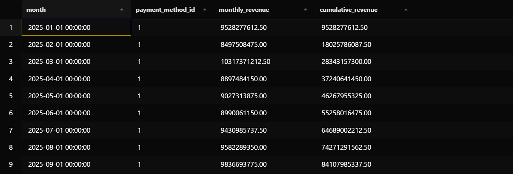
> Al agregar ``PARTITION BY payment_method_id``, el acumulado deja de ser general y pasa a calcularse por separado para cada método de pago. Por eso, cuando cambia el método de pago, el acumulado vuelve a empezar desde cero y suma únicamente los valores correspondientes a ese método. Esto permite ver cómo van creciendo los ingresos de cada forma de pago de manera independiente.

# EJERCICO 5
## A. Construya una ``CTE monthly_sales`` que agrupe ``pay.orders`` por mes y sume el total. Sobre esa CTE calcule: current_month_sales, prev_month_sales con LAG, difference (resta directa) y pct_change redondeado a 2 decimales. Use ``COALESCE(..., 0)`` para que el primer mes muestre 0 en lugar de NULL
```sql
WITH monthly_sales AS (
    SELECT
        DATE_TRUNC('month', T1.order_date) AS month,
        SUM(T1.total) AS monthly_revenue
    FROM pay.orders T1
    GROUP BY DATE_TRUNC('month', T1.order_date)
),
sales_with_previous AS (
    SELECT
        month,
        monthly_revenue AS current_month_sales,
        COALESCE(
            LAG(monthly_revenue) OVER (
                ORDER BY month ASC
            ),
            0
        ) AS prev_month_sales
    FROM monthly_sales
)
SELECT
    month,
    current_month_sales,
    prev_month_sales,
    current_month_sales - prev_month_sales AS difference,
    CASE
        WHEN prev_month_sales = 0 THEN 0
        ELSE ROUND(
            (current_month_sales - prev_month_sales) * 100.0
            / prev_month_sales,
            2
        )
    END AS pct_change
FROM sales_with_previous
ORDER BY month ASC;
```
### **SCREENSHOTS**
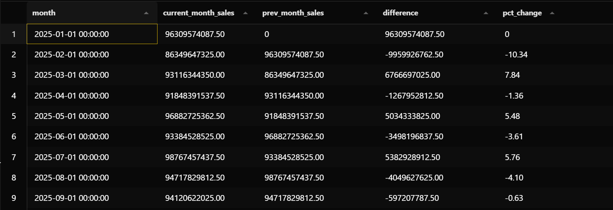
> El mayor crecimiento porcentual se presentó en diciembre de 2025, con un aumento del 39,20% respecto al mes anterior. En cambio, la mayor caída se presentó en marzo de 2026, con una disminución del 14,88%.  

> **MAYOR CRECIMIENTO**
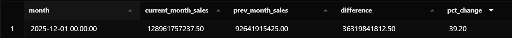
> **MAYOR CAIDA**
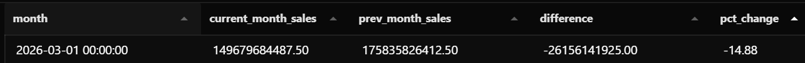


## C. Modifique la consulta para calcular también la variación respecto a dos meses atrás usando ``LAG(..., 2)``. Nombre esta columna ``sales_2months_ago``.
```sql
WITH monthly_sales AS (
    SELECT
        DATE_TRUNC('month', T1.order_date) AS month,
        SUM(T1.total) AS monthly_revenue
    FROM pay.orders T1
    GROUP BY DATE_TRUNC('month', T1.order_date)
),
sales_with_previous AS (
    SELECT
        month,
        monthly_revenue AS current_month_sales,
        COALESCE(
            LAG(monthly_revenue) OVER (
                ORDER BY month ASC
            ),
            0
        ) AS prev_month_sales,
        COALESCE(
            LAG(monthly_revenue, 2) OVER (
                ORDER BY month ASC
            ),
            0
        ) AS sales_2months_ago
    FROM monthly_sales
)
SELECT
    month,
    current_month_sales,
    prev_month_sales,
    sales_2months_ago,
    current_month_sales - prev_month_sales AS difference,
    CASE
        WHEN prev_month_sales = 0 THEN 0
        ELSE ROUND(
            (current_month_sales - prev_month_sales) * 100.0
            / prev_month_sales,
            2
        )
    END AS pct_change
FROM sales_with_previous
ORDER BY month ASC;
```
### **SCREENSHOT**
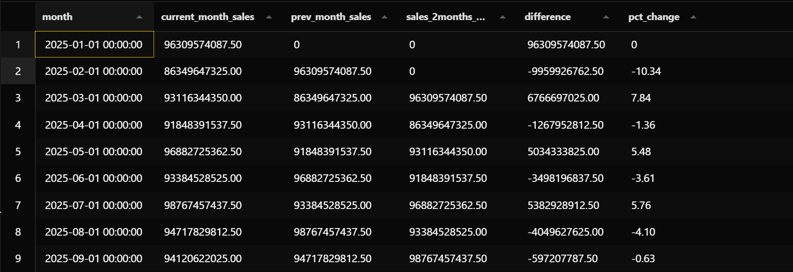

## **Análisis escrito:** ¿Por qué antes de Window Functions se resolvía esta comparación con un JOIN de la tabla contra sí misma? Escriba ese JOIN equivalente (puede ser pseudocódigo SQL) y compare visualmente la cantidad de líneas de código con la versión LAG.
```sql
WITH monthly_sales AS (
    SELECT
        DATE_TRUNC('month', T1.order_date) AS month,
        SUM(T1.total) AS monthly_revenue
    FROM pay.orders T1
    GROUP BY DATE_TRUNC('month', T1.order_date)
)
SELECT
    T1.month,
    T1.monthly_revenue AS current_month_sales,
    COALESCE(T2.monthly_revenue, 0) AS prev_month_sales,
    COALESCE(T3.monthly_revenue, 0) AS sales_2months_ago,
    T1.monthly_revenue - COALESCE(T2.monthly_revenue, 0) AS difference,
    CASE
        WHEN COALESCE(T2.monthly_revenue, 0) = 0 THEN 0
        ELSE ROUND(
            (T1.monthly_revenue - T2.monthly_revenue) * 100.0
            / T2.monthly_revenue,
            2
        )
    END AS pct_change
FROM monthly_sales T1
LEFT JOIN monthly_sales T2
    ON T2.month = T1.month - INTERVAL '1 month'
LEFT JOIN monthly_sales T3
    ON T3.month = T1.month - INTERVAL '2 months'
ORDER BY T1.month ASC;
```

> Antes de las Window Functions, esta comparación se podía hacer uniendo la tabla consigo misma, usando una copia para el mes anterior y otra para dos meses atrás. En este caso, el JOIN incluso puede tener menos líneas, pero requiere indicar manualmente qué mes debe relacionarse con cada fila. Con LAG() la ventaja está en que podemos obtener directamente el valor de una fila anterior según el orden de los meses, haciendo la lógica más sencilla de expresar.

# EJERCICIO 6
## A. Escriba una consulta sobre ``ship.shipment_orders`` que muestre por cada envío: ship_company_id, order_id, created_at, next_shipment_date (usando ``LEAD(created_at)``) y ``days_until_next`` (diferencia entre las dos fechas). Use ``PARTITION BY ship_company_id`` y ``ORDER BY created_at ASC``, id ``ASC`` como desempate

``` sql
SELECT
    T1.ship_company_id,
    T1.order_id,
    T1.created_at,
    LEAD(T1.created_at) OVER (
        PARTITION BY T1.ship_company_id
        ORDER BY T1.created_at ASC, T1.id ASC
    ) AS next_shipment_date,
    LEAD(T1.created_at) OVER (
        PARTITION BY T1.ship_company_id
        ORDER BY T1.created_at ASC, T1.id ASC
    ) - T1.created_at AS days_until_next
FROM ship.shipment_orders T1
ORDER BY T1.ship_company_id, T1.created_at ASC, T1.id ASC;
```
### **SCREENSHOT**
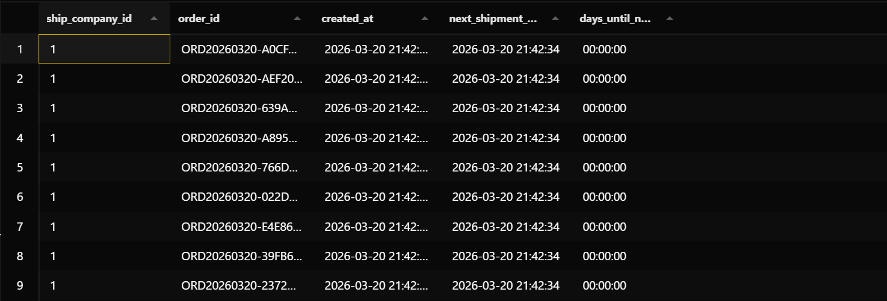

## B. Envuelva la consulta en una CTE y calcule, por empresa, el promedio de días entre envíos consecutivos. Nombre esta columna ``avg_days_between_shipmen`` Ordene de menor a mayor (las empresas más activas primero).

```sql
WITH shipments_with_next AS (
    SELECT
        T1.ship_company_id,
        T1.created_at,
        LEAD(T1.created_at) OVER (
            PARTITION BY T1.ship_company_id
            ORDER BY T1.created_at ASC, T1.id ASC
        ) AS next_shipment_date
    FROM ship.shipment_orders T1
)
SELECT
    ship_company_id,
    AVG(
        EXTRACT(EPOCH FROM (next_shipment_date - created_at)) / 86400
    ) AS avg_days_between_shipmen
FROM shipments_with_next
WHERE next_shipment_date IS NOT NULL
GROUP BY ship_company_id
ORDER BY avg_days_between_shipmen ASC;
```
### **SCREENSHOT**
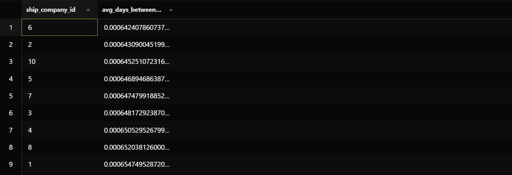

## C. **Análisis escrito y diagrama:** Dibuje una línea de tiempo con al menos 3 envíos ficticios de una misma empresa y marque con flechas los valores que devuelve LEAD en cada fila. Indique claramente dónde aparece el NULL 
### **SCREENSHOT**
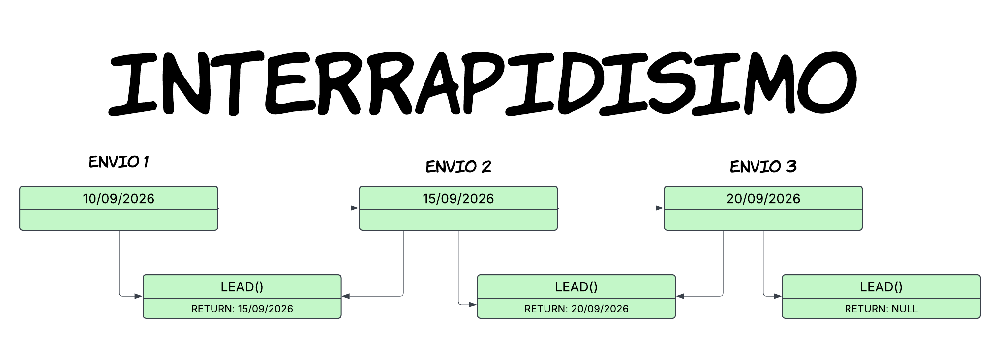

## D. **Comparación LAG vs LEAD:** escriba ambas consultas (con LAG y con LEAD) para obtener el mismo resultado: la fecha del envío adyacente para cada fila. Explique qué cambia entre las dos versiones y en qué dirección aparece el NULL en cada caso.

### CON ```LAG```
```sql
SELECT
    T1.ship_company_id,
    T1.order_id,
    T1.created_at,
    LAG(T1.created_at) OVER (
        PARTITION BY T1.ship_company_id
        ORDER BY T1.created_at ASC, T1.id ASC
    ) AS adjacent_shipment_date
FROM ship.shipment_orders T1
ORDER BY T1.ship_company_id, T1.created_at ASC, T1.id ASC;
```
### **SCREENSHOT**
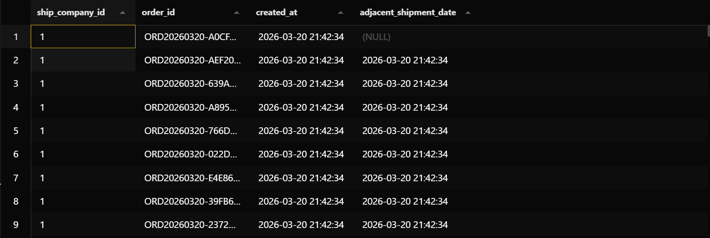
> ``LAG()`` busca hacia atrás, por lo que cada envío obtiene la fecha del envío anterior de la misma empresa.
El primer envío de cada empresa no tiene uno anterior, por eso aparece ``NULL``.

### CON ```LEAD```
```sql
SELECT
    T1.ship_company_id,
    T1.order_id,
    T1.created_at,
    LEAD(T1.created_at) OVER (
        PARTITION BY T1.ship_company_id
        ORDER BY T1.created_at ASC, T1.id ASC
    ) AS adjacent_shipment_date
FROM ship.shipment_orders T1
ORDER BY T1.ship_company_id, T1.created_at ASC, T1.id ASC;
```
### **SCREENSHOT**
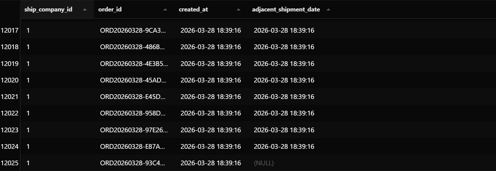
> ``LEAD()`` busca hacia adelante, por lo que cada envío obtiene la fecha del siguiente envío de la misma empresa.
El último envío de cada empresa no tiene uno siguiente, por eso aparece ``NULL``.  

> LAG() y LEAD() permiten obtener la fecha de un envío adyacente dentro de la misma empresa. La diferencia está en la dirección en la que buscan: LAG() mira hacia la fila anterior, mientras que LEAD() mira hacia la fila siguiente.  
>Por eso, con ``LAG()`` el **NULL** aparece en el primer envío de cada empresa, porque no existe un envío anterior. Y con ``LEAD()`` el **NULL** aparece en el último envío, porque no existe un envío posterior.


# EJERCICIO 7
## A. Construya una CTE ranked_products que una pay.order_items, ctg.products y ctg.categories, agrupe por categoría y producto, y calcule total_units y un campo ranking usando ``RANK() OVER (PARTITION BY category_id ORDER BY SUM(quantity) DESC)``. Luego filtre ``WHERE ranking <= 3``.
```sql
WITH ranked_products AS (
    SELECT
        T3.id AS category_id,
        T3.name AS category_name,
        T2.id AS product_id,
        T2.name AS product_name,
        SUM(T1.quantity) AS total_units,
        RANK() OVER (
            PARTITION BY T2.category_id
            ORDER BY SUM(T1.quantity) DESC
        ) AS ranking
    FROM pay.order_items T1
    INNER JOIN ctg.products T2
        ON T1.product_id = T2.id
    INNER JOIN ctg.categories T3
        ON T2.category_id = T3.id
    GROUP BY
        T3.id,
        T3.name,
        T2.id,
        T2.name,
        T2.category_id
)
SELECT
    category_id,
    category_name,
    product_id,
    product_name,
    total_units,
    ranking
FROM ranked_products
WHERE ranking <= 3
ORDER BY category_id, ranking, product_name;
```
### **SCREENSHOT**
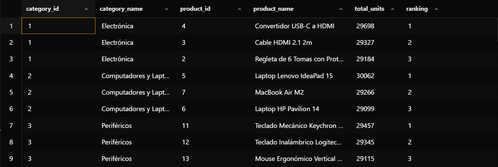

## Verifique que en su resultado cada categoría tiene máximo 3 filas. Si alguna categoría tiene más de 3, ¿cuál sería la causa?

> Al verificar el resultado, todas las categorías tienen como máximo 3 filas, por lo que la consulta funciona correctamente. Esto es porque se aplicó ``WHERE ranking <= 3`` después de calcular el ``RANK()`` en la CTE. Si alguna categoría tuviera más de 3 filas, podria ser porque varios productos tengan la misma cantidad de unidades vendidas. Como se utilizó ``RANK()``, los empates reciben el mismo puesto y pueden hacer que aparezcan más de 3 productos.

##
```sql
WITH ranked_products AS (
    SELECT
        T3.id AS category_id,
        T3.name AS category_name,
        T2.id AS product_id,
        T2.name AS product_name,
        SUM(T1.quantity) AS total_units,
        DENSE_RANK() OVER (
            PARTITION BY T2.category_id
            ORDER BY SUM(T1.quantity) DESC
        ) AS ranking
    FROM pay.order_items T1
    INNER JOIN ctg.products T2
        ON T1.product_id = T2.id
    INNER JOIN ctg.categories T3
        ON T2.category_id = T3.id
    GROUP BY
        T3.id,
        T3.name,
        T2.id,
        T2.name,
        T2.category_id
)
SELECT
    category_id,
    category_name,
    product_id,
    product_name,
    total_units,
    ranking
FROM ranked_products
WHERE ranking <= 3
ORDER BY category_id, ranking, product_name;
```
> Se utiliza DENSE_RANK() porque permite que los productos con la misma cantidad de unidades vendidas compartan el mismo puesto.  
>Para cambiar a utilizar DENSE_RANK(), tambien nos daria los resultados, pero nos dejaria un espacio en los rankings de los nummeros que se repitan, es decir: 1, 2, 3, 3, 3, 6... Aqui se anularian los numeros 4 y 5!  
>Si, es la misma consulta que el punto anterior
### **SCREENSHOT**


## **Generalización:** Reescriba la consulta usando un parámetro ``top_n = 5`` (puede simularlo con un literal en el WHERE). Documente cuántas filas devuelve en total para ``top_n = 1``, ``top_n = 3`` y ``top_n = 5``.
```sql
WITH ranked_products AS (
    SELECT
        T2.category_id,
        T2.id AS product_id,
        SUM(T1.quantity) AS total_units,
        DENSE_RANK() OVER (
            PARTITION BY T2.category_id
            ORDER BY SUM(T1.quantity) DESC
        ) AS ranking
    FROM pay.order_items T1
    INNER JOIN ctg.products T2
        ON T1.product_id = T2.id
    GROUP BY
        T2.category_id,
        T2.id
)
SELECT
    'top_n = 1' AS caso,
    COUNT(*) AS total_filas
FROM ranked_products
WHERE ranking <= 1

UNION ALL

SELECT
    'top_n = 3',
    COUNT(*)
FROM ranked_products
WHERE ranking <= 3

UNION ALL

SELECT
    'top_n = 5',
    COUNT(*)
FROM ranked_products
WHERE ranking <= 5;
```
### **SCREENSHOT**
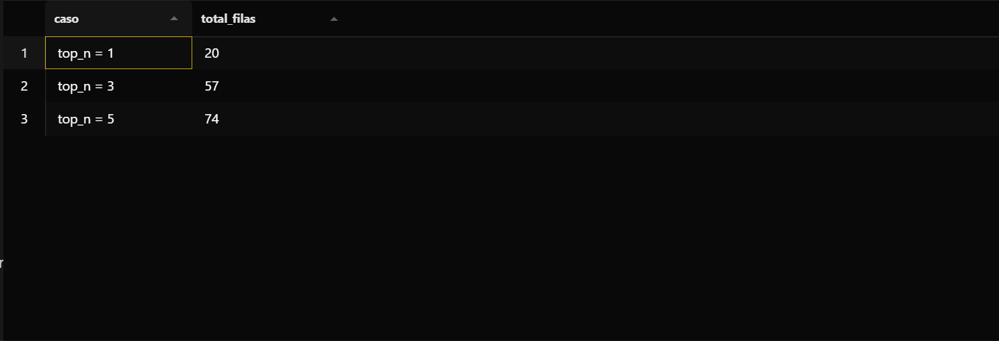

# EJERCICIO 8
## A. Construya una CTE customer_stats que agrupe pay.orders por cliente y calcule: ``total_spent (SUM(total))``, ``total_orders (COUNT(DISTINCT id))``, ``first_purchase (MIN(order_date))``, ``last_purchase (MAX(order_date))`` y global_rank con ``ROW_NUMBER() OVER (ORDER BY SUM(total) DESC)``. Una esa CTE con cs.customers y agregue la columna segment con el siguiente criterio usando ``CASE: VIP: total_spent >10.000.000`` ``Regular: total_spent >3.000.000`` ``New: total_orders >= 1`` ``Inactive: sin órdenes``.
```sql
WITH customer_stats AS (
    SELECT
        T1.customer_id_number,
        SUM(T1.total) AS total_spent,
        COUNT(DISTINCT T1.id) AS total_orders,
        MIN(T1.order_date) AS first_purchase,
        MAX(T1.order_date) AS last_purchase
    FROM pay.orders T1
    GROUP BY T1.customer_id_number
),
customer_ranked AS (
    SELECT
        customer_id_number,
        total_spent,
        total_orders,
        first_purchase,
        last_purchase,
        ROW_NUMBER() OVER (
            ORDER BY total_spent DESC
        ) AS global_rank
    FROM customer_stats
)
SELECT
    T1.id_number,
    T1.name,
    T2.total_spent,
    T2.total_orders,
    T2.first_purchase,
    T2.last_purchase,
    T2.global_rank,
    CASE
        WHEN T2.total_spent > 10000000 THEN 'VIP'
        WHEN T2.total_spent > 3000000 THEN 'Regular'
        WHEN T2.total_orders >= 1 THEN 'New'
        ELSE 'Inactive'
    END AS segment
FROM cs.customers T1
LEFT JOIN customer_ranked T2
    ON T1.id_number = T2.customer_id_number
ORDER BY T2.global_rank NULLS LAST;
```
### **SCREENSHOT**
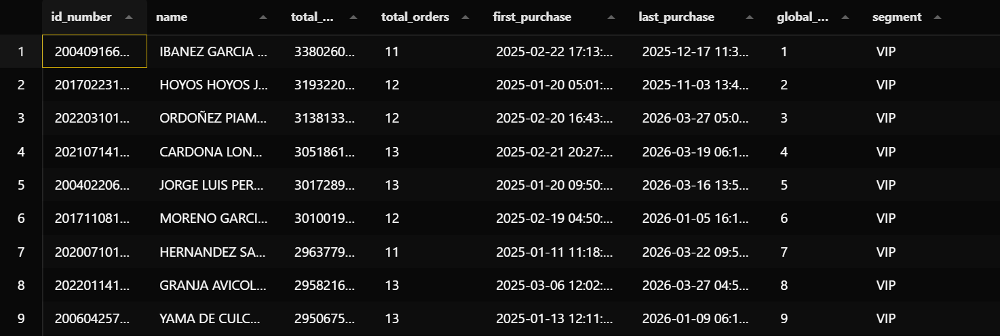


## B. Consulte cuántos clientes hay en cada segmento usando ``COUNT(*)`` agrupado por segment. Documente la distribución completa.
```sql
WITH customer_stats AS (
    SELECT
        T1.customer_id_number,
        SUM(T1.total) AS total_spent,
        COUNT(DISTINCT T1.id) AS total_orders,
        MIN(T1.order_date) AS first_purchase,
        MAX(T1.order_date) AS last_purchase
    FROM pay.orders T1
    GROUP BY T1.customer_id_number
),
customer_ranked AS (
    SELECT
        customer_id_number,
        total_spent,
        total_orders,
        first_purchase,
        last_purchase,
        ROW_NUMBER() OVER (
            ORDER BY total_spent DESC
        ) AS global_rank
    FROM customer_stats
),
segmented_customers AS (
    SELECT
        T1.id_number,
        CASE
            WHEN T2.total_spent > 10000000 THEN 'VIP'
            WHEN T2.total_spent > 3000000 THEN 'Regular'
            WHEN T2.total_orders >= 1 THEN 'New'
            ELSE 'Inactive'
        END AS segment
    FROM cs.customers T1
    LEFT JOIN customer_ranked T2
        ON T1.id_number = T2.customer_id_number
)
SELECT
    segment,
    COUNT(*) AS total_customers
FROM segmented_customers
GROUP BY segment
ORDER BY total_customers DESC;
```
### **SCREENSHOT**
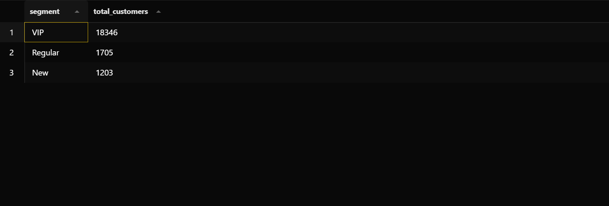

## **Diagrama de distribución:** con los conteos del literal anterior, dibuje un diagrama de barras horizontal El eje X debe mostrar cantidad de clientes y el eje Y los 4 segmentos.
### **DIAGRAMA**
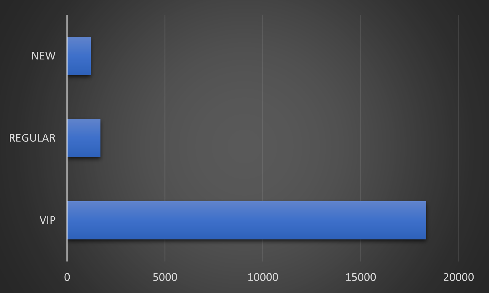

## Filtre únicamente los clientes VIP y muéstrelos ordenados por ``global_rank`` ascendente. Documente cuántos clientes VIP existen en la base de datos.
```sql
WITH customer_stats AS (
    SELECT
        T1.customer_id_number,
        SUM(T1.total) AS total_spent,
        COUNT(DISTINCT T1.id) AS total_orders,
        MIN(T1.order_date) AS first_purchase,
        MAX(T1.order_date) AS last_purchase
    FROM pay.orders T1
    GROUP BY T1.customer_id_number
),
customer_ranked AS (
    SELECT
        customer_id_number,
        total_spent,
        total_orders,
        first_purchase,
        last_purchase,
        ROW_NUMBER() OVER (
            ORDER BY total_spent DESC
        ) AS global_rank
    FROM customer_stats
)
SELECT
    T1.id_number,
    T1.name,
    T2.total_spent,
    T2.total_orders,
    T2.first_purchase,
    T2.last_purchase,
    T2.global_rank,
    'VIP' AS segment
FROM cs.customers T1
INNER JOIN customer_ranked T2
    ON T1.id_number = T2.customer_id_number
WHERE T2.total_spent > 10000000
ORDER BY T2.global_rank ASC;
```
### **SCREENSHOT**
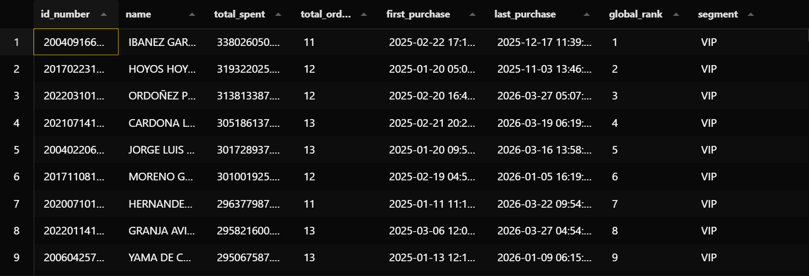

# EJERCICIO 9
## A. Seleccione tres clientes de su elección de la tabla cs.customers y construya la consulta integradora usando CTEs. La consulta debe devolver exactamente 3 filas — una por cliente — con los campos: customer_name, first_order_date, first_order_total, total_spent, total_orders, current_month_sales, prev_month_sales, difference.

```sql
WITH selected_customers AS (
    SELECT
        T1.id_number,
        T1.name
    FROM cs.customers T1
    ORDER BY T1.id_number
    LIMIT 3
),
customer_orders AS (
    SELECT
        T1.id_number,
        T1.name AS customer_name,
        T2.id AS order_id,
        T2.order_date,
        T2.total,
        ROW_NUMBER() OVER (
            PARTITION BY T1.id_number
            ORDER BY T2.order_date ASC, T2.id ASC
        ) AS order_number,
        SUM(T2.total) OVER (
            PARTITION BY T1.id_number
        ) AS total_spent,
        COUNT(T2.id) OVER (
            PARTITION BY T1.id_number
        ) AS total_orders
    FROM selected_customers T1
    INNER JOIN pay.orders T2
        ON T1.id_number = T2.customer_id_number
),
first_orders AS (
    SELECT
        id_number,
        customer_name,
        order_date AS first_order_date,
        total AS first_order_total,
        total_spent,
        total_orders
    FROM customer_orders
    WHERE order_number = 1
),
monthly_sales AS (
    SELECT
        id_number,
        DATE_TRUNC('month', order_date) AS month,
        SUM(total) AS monthly_sales
    FROM customer_orders
    GROUP BY
        id_number,
        DATE_TRUNC('month', order_date)
),
monthly_comparison AS (
    SELECT
        id_number,
        month,
        monthly_sales AS current_month_sales,
        LAG(monthly_sales) OVER (
            PARTITION BY id_number
            ORDER BY month ASC
        ) AS prev_month_sales,
        ROW_NUMBER() OVER (
            PARTITION BY id_number
            ORDER BY month DESC
        ) AS month_number
    FROM monthly_sales
)
SELECT
    T1.customer_name,
    T1.first_order_date,
    T1.first_order_total,
    T1.total_spent,
    T1.total_orders,
    T2.current_month_sales,
    T2.prev_month_sales,
    T2.current_month_sales - T2.prev_month_sales AS difference
FROM first_orders T1
INNER JOIN monthly_comparison T2
    ON T1.id_number = T2.id_number
WHERE T2.month_number = 1
ORDER BY T1.id_number;
```
### **SCREENSHOT**
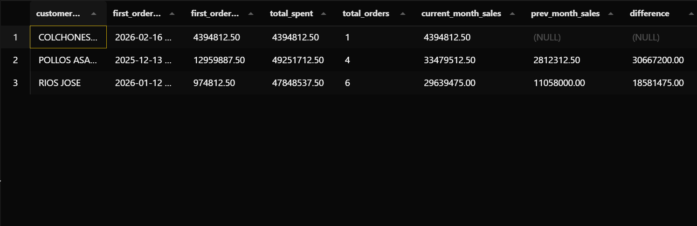

## B. Documente las CTEs que construyó, una por una, explicando qué Window Function resuelve cada pregunta del jefe.


| Pregunta del jefe         | CTE                                    | Función usada  |
|---------------------------|----------------------------------------|----------------|
| Primera orden por cliente | `customer_orders` / `first_orders`     | `ROW_NUMBER()` |
| Total gastado             | `customer_orders`                      | `SUM() OVER`   |
| Este mes vs mes anterior  | `monthly_sales` / `monthly_comparison` | `LAG()`        |

> ``selected_customers``: selecciona los tres clientes que se van a analizar.  
>``customer_orders``: obtiene las órdenes de esos clientes. Aquí se utiliza ROW_NUMBER() para numerar las órdenes de cada cliente desde la más antigua y SUM() OVER para calcular el gasto total de cada cliente.  
>``first_orders``: utiliza el resultado de ROW_NUMBER() para quedarse únicamente con la primera orden de cada cliente.  
>``monthly_sales``: agrupa las ventas de cada cliente por mes para poder realizar la comparación mensual.  
>``monthly_comparison``: utiliza LAG() para obtener las ventas del mes anterior y ROW_NUMBER() para identificar el mes más reciente de cada cliente.

## C. **Comparación de versiones:** En el taller de clase se construyó la misma consulta sin Window Functions, usando subconsultas y un JOIN de la tabla contra sí misma para la comparación mensual. Reproduzca esa versión en su documento y cuente las líneas de código de cada versión. Documente la diferencia.
```sql
WITH selected_customers AS (
    SELECT
        T1.id_number,
        T1.name
    FROM cs.customers T1
    ORDER BY T1.id_number
    LIMIT 3
),
customer_stats AS (
    SELECT
        T1.id_number,
        T1.name AS customer_name,
        (
            SELECT MIN(T2.order_date)
            FROM pay.orders T2
            WHERE T2.customer_id_number = T1.id_number
        ) AS first_order_date,
        (
            SELECT T2.total
            FROM pay.orders T2
            WHERE T2.customer_id_number = T1.id_number
            ORDER BY T2.order_date ASC, T2.id ASC
            LIMIT 1
        ) AS first_order_total,
        (
            SELECT SUM(T2.total)
            FROM pay.orders T2
            WHERE T2.customer_id_number = T1.id_number
        ) AS total_spent,
        (
            SELECT COUNT(*)
            FROM pay.orders T2
            WHERE T2.customer_id_number = T1.id_number
        ) AS total_orders
    FROM selected_customers T1
),
monthly_sales AS (
    SELECT
        T1.customer_id_number,
        DATE_TRUNC('month', T1.order_date) AS month,
        SUM(T1.total) AS monthly_sales
    FROM pay.orders T1
    INNER JOIN selected_customers T2
        ON T1.customer_id_number = T2.id_number
    GROUP BY
        T1.customer_id_number,
        DATE_TRUNC('month', T1.order_date)
),
latest_month AS (
    SELECT
        T1.customer_id_number,
        MAX(T1.month) AS month
    FROM monthly_sales T1
    GROUP BY T1.customer_id_number
)
SELECT
    T1.customer_name,
    T1.first_order_date,
    T1.first_order_total,
    T1.total_spent,
    T1.total_orders,
    T2.monthly_sales AS current_month_sales,
    COALESCE(T3.monthly_sales, 0) AS prev_month_sales,
    T2.monthly_sales - COALESCE(T3.monthly_sales, 0) AS difference
FROM customer_stats T1
INNER JOIN latest_month T4
    ON T1.id_number = T4.customer_id_number
INNER JOIN monthly_sales T2
    ON T4.customer_id_number = T2.customer_id_number
    AND T4.month = T2.month
LEFT JOIN monthly_sales T3
    ON T2.customer_id_number = T3.customer_id_number
    AND T3.month = T2.month - INTERVAL '1 month'
ORDER BY T1.id_number;
```
### **SCREENSHOT**
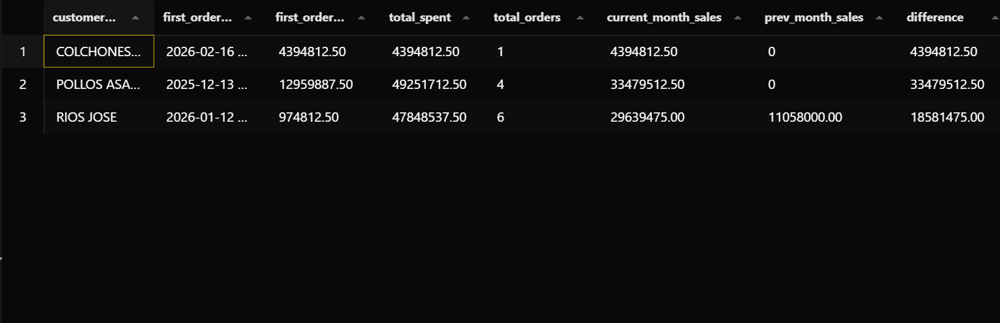

>Realice la consulta sin Windows Functions. Se utilizaron subconsultas para obtener la primera orden, el total gastado y la cantidad de órdenes. Para comparar las ventas del mes actual con el mes anterior se utilizó un JOIN de la CTE monthly_sales contra sí misma.

>Con Windows Functions tiene 79 líneas de código, mientras que la versión sin Window Functions tiene 74 líneas. Aunque la diferencia en cantidad de líneas no es mucha, las Window Functions permiten expresar de forma más directa operaciones como obtener la primera orden de cada cliente, calcular acumulados y acceder a la fila anterior usando el  ``LAG()``.


## D. **Análisis escrito:** ¿Cuántas veces se lee la tabla pay.orders en la versión sin Window Functions vs la versión con Window Functions? Explique el impacto de esta diferencia cuando la tabla tiene 16.258 registros y cuando tiene 16.000.000.

> En la versión sin Window Functions, la tabla ``pay.orders`` se consulta varias veces: una vez para obtener la primera fecha, otra para obtener el total de la primera orden, otra para calcular el gasto total, otra para contar las órdenes y otra para construir las ventas mensuales. En cambio, en la versión con Window Functions, pay.orders se consulta una sola vez y las funciones ``ROW_NUMBER()``, ``SUM() OVER`` y ``LAG()`` trabajan sobre los datos obtenidos.

# EJERCICIO 10
## A. Proponga un caso de uso no visto en clase que se pueda resolver con Window Functions sobre este mismo esquema. El caso debe involucrar al menos dos tablas y responder una pregunta de negocio real. Descríbalo en máximo 5 líneas.

> El área de ventas quiere conocer cuáles son los productos más vendidos dentro de cada categoría. Para esto se pueden utilizar las tablas pay.order_items y ctg.products. Con una Window Function como ``RANK()`` se puede ordenar los productos según la cantidad de unidades vendidas en cada categoría. Así se pueden identificar rápidamente los productos que tienen mayor demanda dentro de cada categoría.

## B. Identifique qué función usaría (ROW_NUMBER, RANK, SUM OVER, LAG o LEAD) y justifique por qué esa función específica es la adecuada para  su caso. Explique también qué iría en PARTITION BY y qué en ORDER BY

> Usaría RANK() porque necesito ordenar los productos según la cantidad de unidades vendidas y además conservar los empates entre productos.  
>En PARTITION BY colocaría category_id, para que el ranking se reinicie en cada categoría.  
>En ORDER BY colocaría la suma de unidades vendidas en orden descendente, de manera que el producto con más unidades quede en el primer puesto.

## C. Implemente la consulta y documéntela
```sql
WITH product_sales AS (
    SELECT
        T2.category_id,
        T2.id AS product_id,
        T2.name AS product_name,
        SUM(T1.quantity) AS total_units,
        RANK() OVER (
            PARTITION BY T2.category_id
            ORDER BY SUM(T1.quantity) DESC
        ) AS ranking
    FROM pay.order_items T1
    INNER JOIN ctg.products T2
        ON T1.product_id = T2.id
    GROUP BY
        T2.category_id,
        T2.id,
        T2.name
)
SELECT
    category_id,
    product_id,
    product_name,
    total_units,
    ranking
FROM product_sales
WHERE ranking <= 3
ORDER BY category_id, ranking, product_name;
```
### **SCREENSHOT**
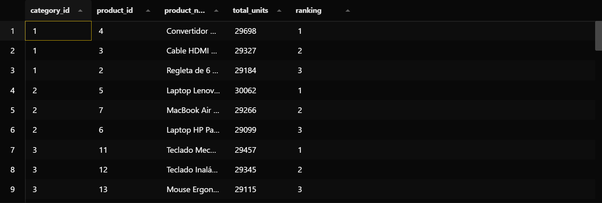

## D. Diagrama: dibuje el esquema de particiones que aplica su Window Function: muestre con rectángulos de colores los grupos que forma el PARTITION BY y con flechas el orden interno de cada grupo. Inserte la imagen en el Markdown.

### **DIAGRAMA**
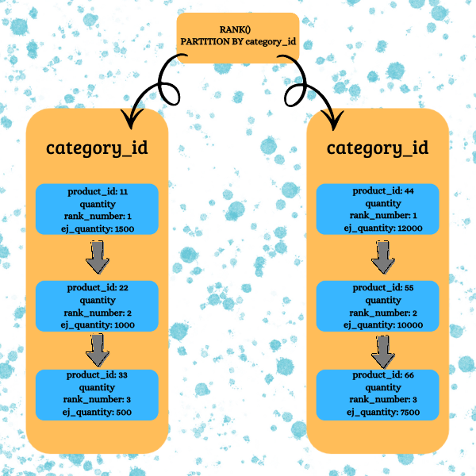

## E.  **Reflexión final:** ¿Qué habría tenido que hacer para resolver el mismo caso sin Window Functions? Describa los pasos (no necesita escribir el código) y concluya si la Window Function simplifica o no simplifica la solución, y en qué medida.

> Sin Window Functions habría tenido que calcular primero las ventas de cada producto, agruparlas por categoría y después buscar una forma de ordenar y obtener los primeros productos de cada grupo. También tendría que hacer consultas adicionales o utilizar subconsultas para comparar los productos dentro de cada categoría.   
> Con ``RANK()`` la solución se simplifica bastante, porque puedo agrupar las ventas y al mismo tiempo generar el puesto de cada producto dentro de su categoría. De esta forma, no necesito hacer comparaciones manuales entre los productos.