# EJERCICIO 1: Vista normal — Detalle completo de órdenes

## Cree la vista cs.v_order_detail con los campos descritos
```sql 
CREATE OR REPLACE VIEW cs.v_order_detail
  AS
SELECT
  T3.name AS customer_name,T3.email,T1.order_id,T2.order_date,
  T4.name AS product_name,T1.quantity,T4.cop_price,T4.usd_price,
  (T1.quantity * T4.cop_price) AS subtotal_cop,
  (T1.quantity * T4.usd_price) AS subtotal_usd
FROM pay.order_items T1
INNER JOIN pay.orders T2
ON T1.order_id = T2.id
INNER JOIN cs.customers T3
ON T2.customer_id_number = T3.id_number
INNER JOIN ctg.products T4
ON T1.product_id = T4.id
GROUP BY T3.name,T3.email,T1.order_id,T2.order_date,T4.name,T1.quantity,T4.cop_price,T4.usd_price;
```
### **SCREENSHOT**


## Consulte la vista filtrando por un order_id específico

```sql
SELECT * 
  FROM cs.v_order_detail
WHERE order_id = 'ORD20260328-D7DFC6A';
```
### **SCREENSHOT**
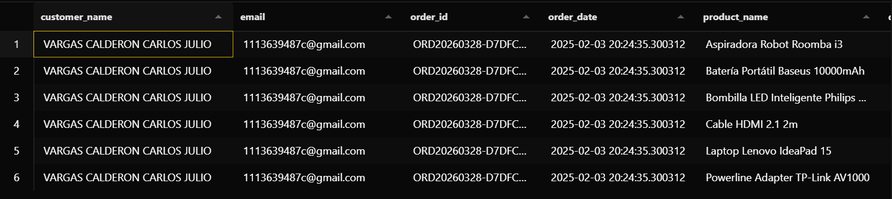
## Consulte la vista ordenando los resultados por fecha de orden de manera descendente.

```sql
SELECT * 
  FROM cs.v_order_detail
ORDER BY 4 DESC;
```
### **SCREENSHOT**
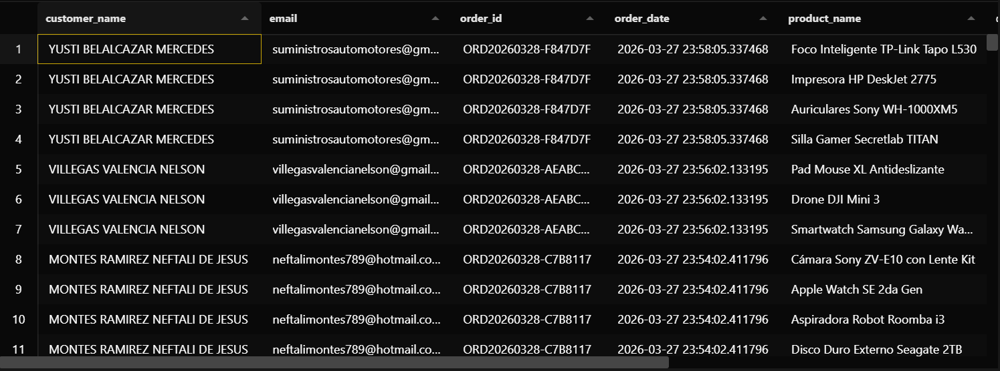
----
# EJERCICIO 2: Vista normal — Resumen por cliente

## Cree la vista con los campos necesarios.
```sql 
CREATE OR REPLACE VIEW cs.v_customer_summary
AS
SELECT
  T3.name AS customer_name,
  COUNT(T2.id) AS quantity_orders,
  SUM(T1.quantity * T4.usd_price) AS total_usd,
  MAX(T2.order_date) AS last_order
FROM pay.order_items T1
INNER JOIN pay.orders T2
ON T1.order_id = T2.id
INNER JOIN cs.customers T3
ON T2.customer_id_number = T3.id_number
INNER JOIN ctg.products T4
ON T1.product_id = T4.id
GROUP BY T3.name
ORDER BY 1;
```
### **SCREENSHOT**

## Consulte la vista ordenando por total gastado de mayor a menor.
```sql 
SELECT * 
FROM cs.v_customer_summary
ORDER BY total_usd DESC;
```
### **SCREENSHOT**
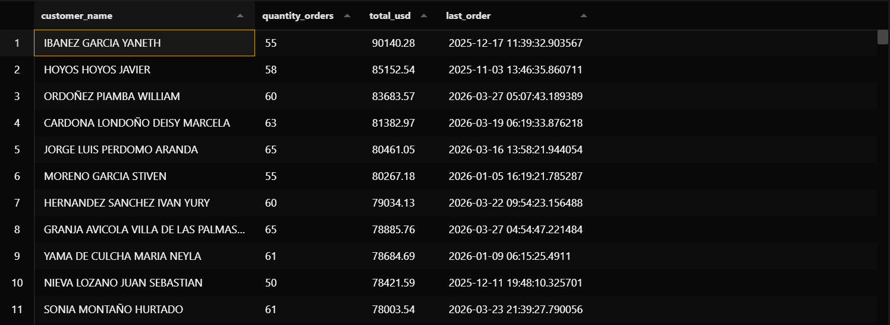
## Consulte únicamente los clientes que tienen al menos una orden registrada.
```sql 
SELECT * 
FROM cs.v_customer_summary
WHERE quantity_orders >= 1
ORDER BY quantity_orders;
```
### **SCREENSHOT**
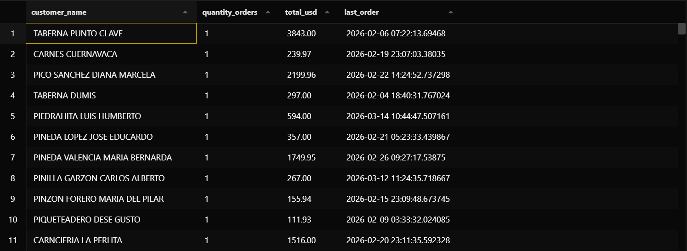

# EJERCICIO 3
## Cree la vista con los campos descritos.
```sql
CREATE OR REPLACE VIEW cs.v_products_with_category
  AS
SELECT
  T1.id AS product_id,
  T1.name AS name_product,
  T1.usd_price,
  T1.cop_price,
  COALESCE(T2.name, 'Sin categoría') AS name_category
FROM ctg.products T1
LEFT JOIN ctg.categories T2 ON T1.category_id = T2.id;
```
### **SCREENSHOT**


## Consulte la vista filtrando únicamente los productos que sí tienen categoría asignada.
```sql
SELECT * 
  FROM
  cs.v_products_with_category
WHERE name_category = 'Sin categoría';
```
### **SCREENSHOT**
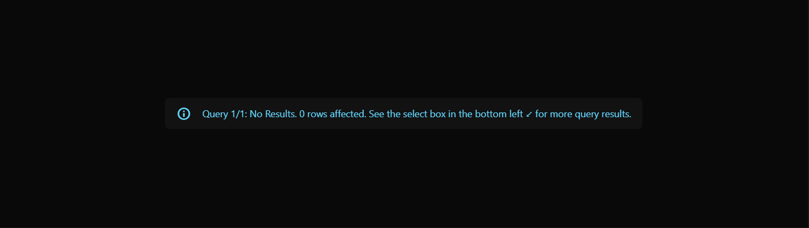

## Consulte la vista ordenando por precio en USD de mayor a menor.
```sql
SELECT * FROM cs.v_products_with_category
ORDER BY usd_price DESC;
```
### **SCREENSHOT**
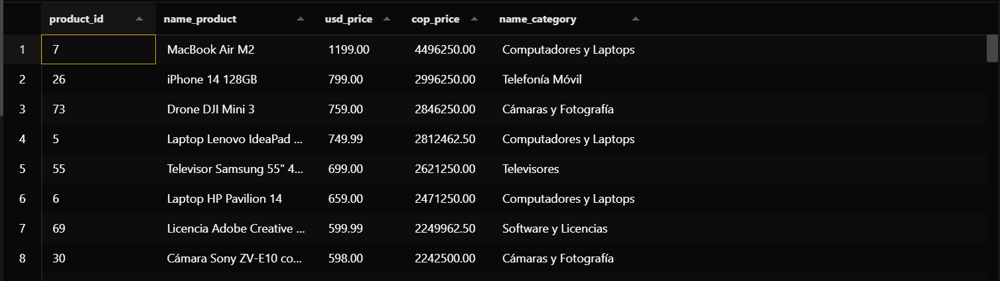

# EJERCICIO 4
## Cree la vista utilizando la cláusula WITH CHECK OPTION.
``` sql
CREATE OR REPLACE VIEW cs.v_customer_contact
AS
  SELECT
  id_number,
  name,
  email,
  phone_number
FROM cs.customers
WITH CHECK OPTION;
```
### **SCREENSHOT**


## Realice un UPDATE a través de la vista para modificar el número de teléfono de un cliente existente
``` sql
UPDATE cs.v_customer_contact
SET phone_number = '3125937618'
WHERE id_number = '1280058';
```
### **SCREENSHOT**


## Verifique mediante un SELECT directo sobre cs.customers que el cambio se refleja en la tabla base

```sql
SELECT
  id_number,
  phone_number
FROM cs.customers
  WHERE id_number = '1280058';
```
### **SCREENSHOT**
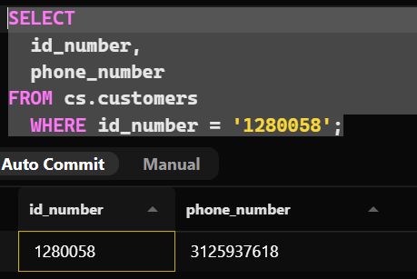

## Explique en el documento Markdown, con sus propias palabras, qué rol cumple WITH CHECK OPTION en esta vista y en qué escenario concreto activaría un error.

>En esta vista, la clausula WITH CHECK OPTION realmente no esta teniendo ningun rol, porque esta clausula sirve para dar un "blindaje" al codigo en caso de condiciones, es decir, para que no se puedan realizar cambios siempre y cuando vaya a romper la condicion.
Esta clausula realmente seria util en un escenario como: Evitar que se vayan a hacer modificaciones de un precio y que este este por debajo de un valor ya definido.
**ESCENARIO DE ERROR**: Se nos activaria un error al momento de que se quiera realizar una modificacion a un dato y el dato nuevo, no cumpla con la condicion predefinida en la vista, ejemplo:
```WHERE cop_price > 5000 ```  Si se intentara modificar el precio por uno menor o igual a 5000, se activaria el error de nuestro WITH CHECK OPTION


# EJERCICIO 5
##  Cree la vista materializada con los campos descritos
```sql
CREATE MATERIALIZED VIEW cs.mv_sales_by_product
  AS
SELECT
  T1.name,
  SUM(T2.quantity) AS quantity,
  SUM(T2.quantity * T1.usd_price) AS usd_total,
  SUM(T2.quantity * T1.cop_price) AS cop_total  
FROM ctg.products T1
INNER JOIN pay.order_items T2 ON T1.id = T2.product_id
GROUP BY T1.name;
```
### **SCREENSHOT**


## Consulte la vista y registre el resultado inicial.
```sql 
SELECT * FROM cs.mv_sales_by_product;
```
### **SCREENSHOT**
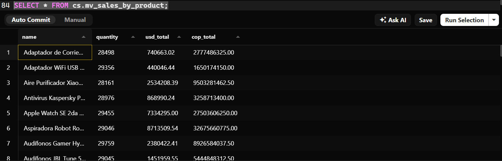

## Inserte un nuevo order_item asociado a un producto existente y vuelva a consultar la vista. Documente si el nuevo registro aparece o no, y explique porqué

```sql
INSERT INTO pay.order_items(order_id, product_id, quantity)
VALUES ('ORD20260320-5D34997', 1, 350);
```
> En este caso, al consultar la vista creada anteriormente, no apareceria el cambio de los datos, debido a que la vista sigue quedando con la informacion que tenia antes de realizar un cambio dentro de esta.

### **SCREENSHOT**
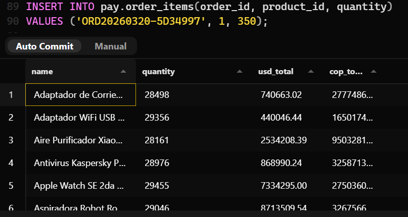

##  Ejecute REFRESH MATERIALIZED VIEW y consulte nuevamente. Documente qué cambió.
```sql
REFRESH MATERIALIZED VIEW cs.mv_sales_by_product;
```
###  EJECUCION DEL REFRESH
### **SCREENSHOT**
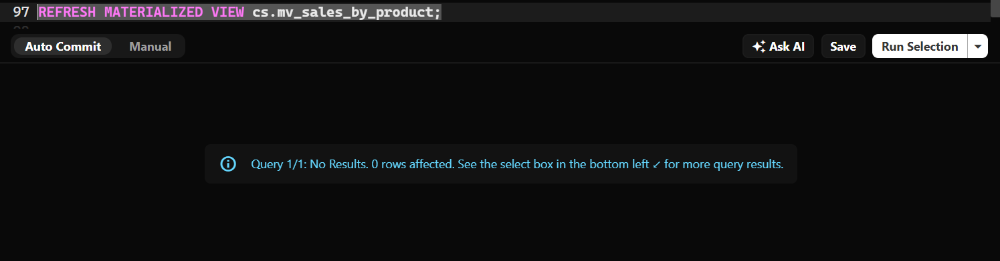

###  EJECUCION DE LA VISTA NUEVAMENTE
### **SCREENSHOT**
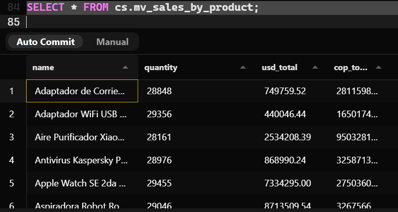

> El cambio que se evidencia es la cantidad de productos agregados en el INSERT anterior! Para efectos de la practica, se realizo el insert de 350 unidades del producto con ```id=1```... Al ejecutar la consulta de la vista, se evidencia el cambio de precios, tanto el cop, como el usd, tammbien la cantidad de productos vendidos

# EJERCICIO 6:
## Cree la vista materializada con los campos y la segmentación descritos.

```sql
CREATE MATERIALIZED VIEW cs.mv_customer_segments
  AS
SELECT
  T1.name,
  T1.email,
  COUNT(DISTINCT T2.id) AS total_orders,
  SUM(T3.quantity * T4.usd_price) AS total_usd,
  CASE
    WHEN (SUM(T3.quantity * T4.usd_price) > 800) THEN 'VIP'
    WHEN (SUM(T3.quantity * T4.usd_price) > 300) AND (SUM(T3.quantity * T4.usd_price) <= 800) THEN 'REGULAR'
    WHEN (SUM(T3.quantity * T4.usd_price) > 0) AND (SUM(T3.quantity * T4.usd_price) <=300) THEN 'NEW'
    ELSE 'INACTIVE'
  END AS classification
FROM cs.customers T1
LEFT JOIN pay.orders T2 ON T1.id_number = T2.customer_id_number
LEFT JOIN pay.order_items T3 ON T3.order_id = T2.id
LEFT JOIN ctg.products T4 ON T3.product_id = T4.id
GROUP BY T1.name, T1.email
  ORDER BY total_orders;
```
### **SCREENSHOT**


## Consulte la vista filtrando únicamente los clientes del segmento VIP.

```sql
SELECT * 
  FROM cs.mv_customer_segments 
  WHERE classification = 'VIP';
```
### **SCREENSHOT**
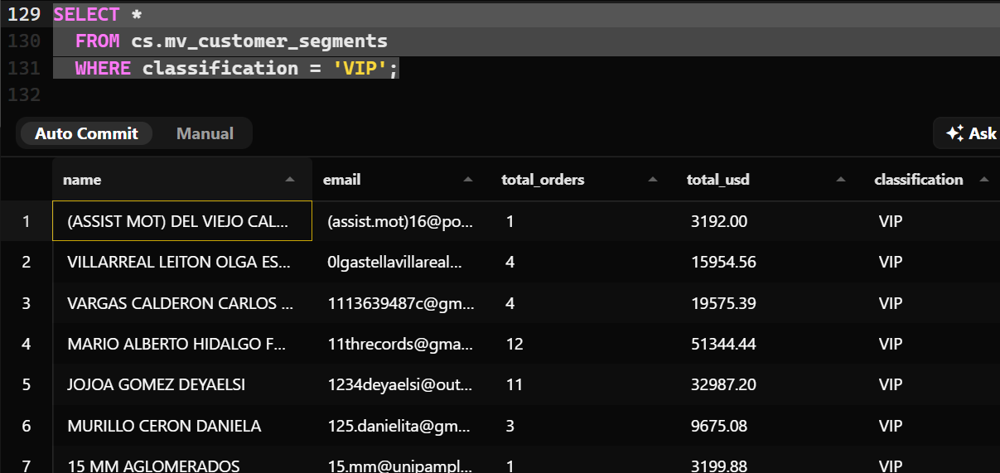


## Consulte cuántos clientes hay en cada segmento.
```sql
SELECT
  COUNT(*) FILTER(WHERE classification = 'VIP') AS quantity_vip,
  COUNT(*) FILTER(WHERE classification = 'REGULAR') AS quantity_regular,
  COUNT(*) FILTER(WHERE classification = 'NEW') AS quantity_new,
  COUNT(*) FILTER(WHERE classification = 'INACTIVE') AS quantity_inactive
FROM cs.mv_customer_segments;
```
### **SCREENSHOT**
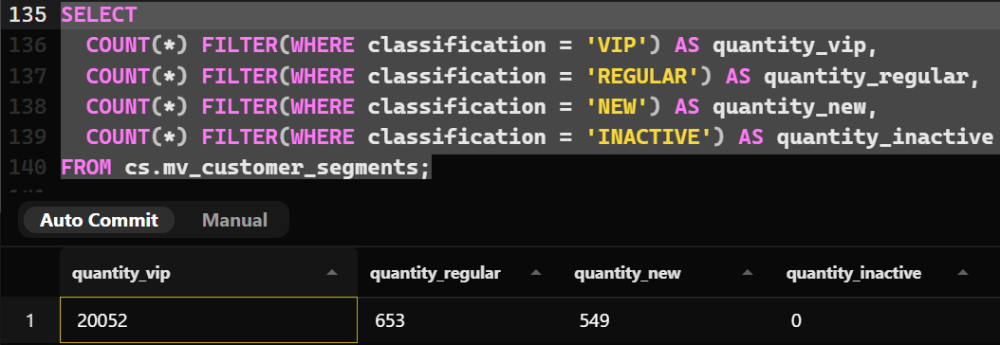


## Ejecute un REFRESH y verifique que los datos se actualizan correctamente insertando un nuevo cliente con órdenes.

### INSERCION DE UN NUEVO CLIENTE EN ```cs.customers```
```sql
INSERT INTO cs.customers(id_number, birth_date, phone_number, name, email)
  VALUES('1091354611', '2005-01-28', '3214763435', 'CRISTIAN CAMILO RANGEL GONZALEZ',
          'cristian.rangel.sf@gmail.com');
```
### **SCREENSHOT**
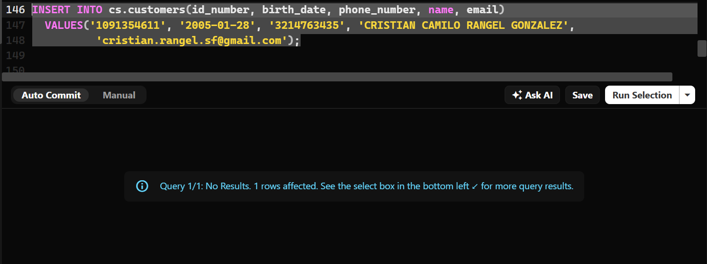


### REFRESH PARA ACTUALIZAR EL CLIENTE EN LA VISTA
```sql
REFRESH MATERIALIZED VIEW cs.mv_customer_segments;
```
### **SCREENSHOT**
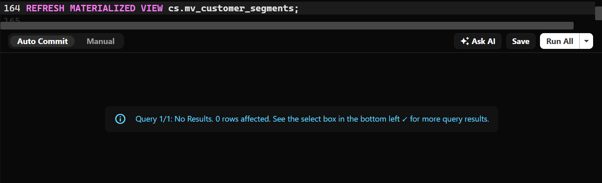


### INSERTAMOS UNA NUEVA ORDEN EN ```pay.orders```
```sql
INSERT INTO pay.orders(id,customer_id_number, order_date, payment_method_id)
  VALUES('ORD20260920-C281A9E','1091354611', '2026-09-20', 1);
```
### **SCREENSHOT**
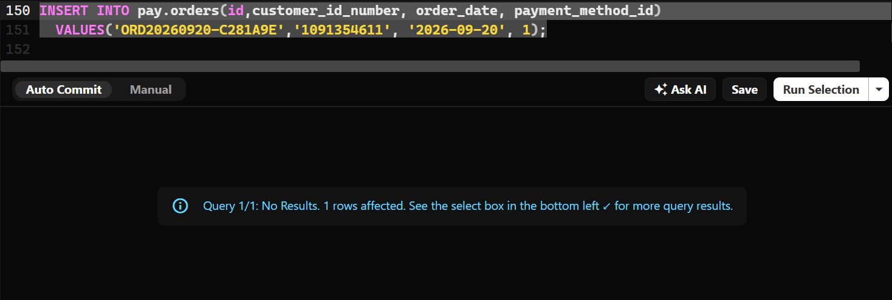


### REFRESH PARA VERIFICAR EXISTENCIA
```sql
REFRESH MATERIALIZED VIEW cs.mv_customer_segments;
```
### **SCREENSHOT**


### VERIFICAMOS CLASIFICACION SIN INSERTAR UN ```order_items```
```sql
SELECT * FROM cs.mv_customer_segments
  ORDER BY classification;
```
### **SCREENSHOT**
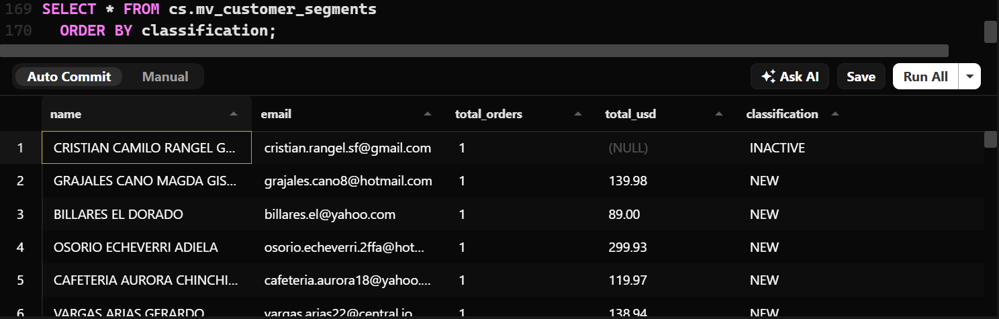


### INSERTAMOS UN ```order_items``` Para verificar el cambio de clasificacion
```sql
INSERT INTO pay.order_items(order_id, product_id, quantity)
  VALUES('ORD20260920-C281A9E', 11, 1);
```
### **SCREENSHOT**
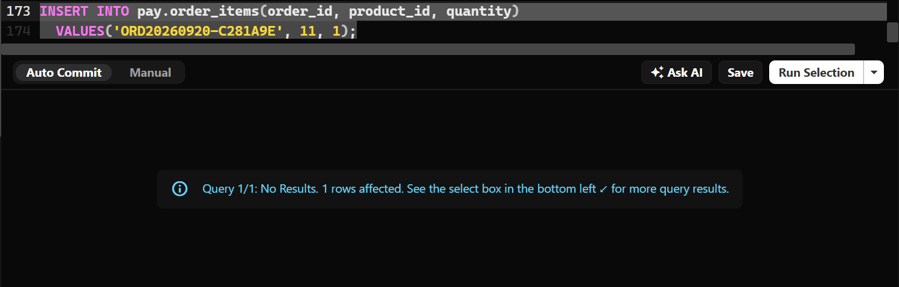


### REFRESH PARA VERIFICAR CAMBIO DE CLASIFICACION
```sql
REFRESH MATERIALIZED VIEW cs.mv_customer_segments;
```
### **SCREENSHOT**


### CONSULTAMOS EL CAMBIO DE CLASIFICACION
```sql
SELECT * FROM cs.mv_customer_segments
  WHERE name = 'CRISTIAN CAMILO RANGEL GONZALEZ';
```
### **SCREENSHOT**
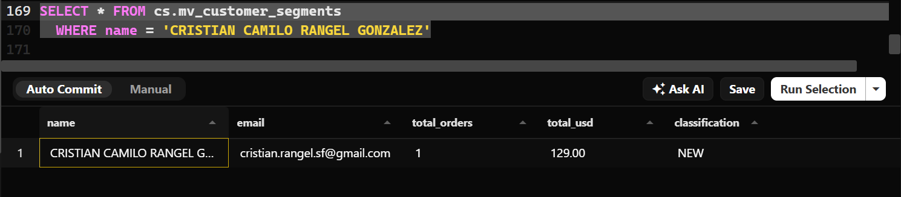


### INSERTAMOS OTRO ```order_items``` Para seguir verificando las sumas y clasificacion
```sql
INSERT INTO pay.order_items(order_id, product_id, quantity)
  VALUES('ORD20260920-C281A9E', 7, 6);
```
### **SCREENSHOT**
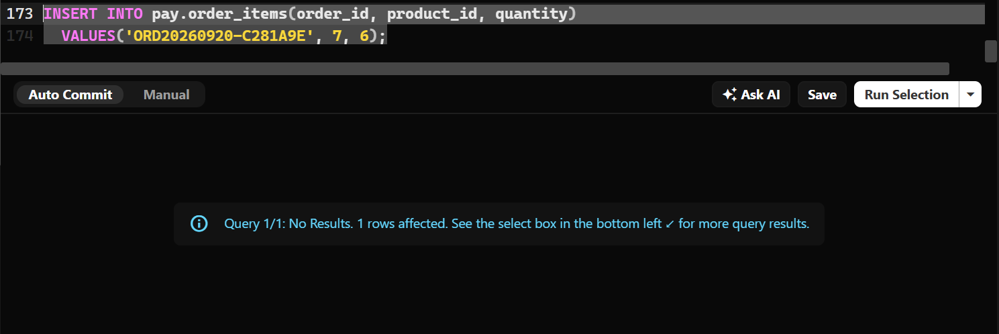

### REFRESH PARA VERIFICAR CAMBIO DE CLASIFICACION
```sql
REFRESH MATERIALIZED VIEW cs.mv_customer_segments;
```
### **SCREENSHOT**


### CONSULTAMOS EL CAMBIO DE CLASIFICACION
```sql
SELECT * FROM cs.mv_customer_segments
  WHERE name = 'CRISTIAN CAMILO RANGEL GONZALEZ';
```
### **SCREENSHOT**
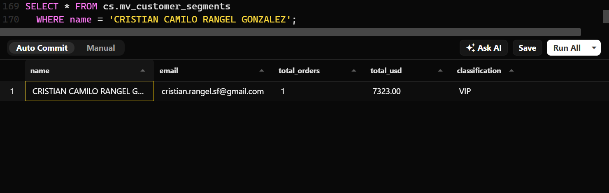

## EJERCICIO 7
### Diseño — Vista recursiva

### **Descripción del Caso de Uso**
**¿Qué problema de negocio resuelve?**
#### En una tienda en línea se necesita registrar el destino de los envíos de forma estructurada para calcular costos de flete, impuestos regionales y tiempos de entrega. Las ubicaciones se organizan en árbol (País/Departamento/Ciudad/Municipio/Barrio).
#### ESTA VISTA PERMITE:
**Calcular costos de envío:**  
Identificar a qué estado o país pertenece una ciudad para aplicar las tarifas correspondientes.  
**Generar etiquetas de envío:**  
Formatear la dirección completa desde la localidad más específica hasta el país de destino.  
**¿Qué información jerárquica se necesita representar?**  
Una relación padre-hijo donde una región superior (padre) contiene a varias sub-regiones o ciudades (hijos) dentro de la misma tabla.

**Definición de la Nueva Tabla**  
Proponemos la tabla cs.locations dentro del esquema cs. La relación jerárquica la genera la columna parent_id, que apunta al identificador de la ubicación superior.
```sql
CREATE TABLE cs.locations (
    id INT PRIMARY KEY,
    name VARCHAR(100) NOT NULL,
    type VARCHAR(30) NOT NULL, -- 'COUNTRY', 'DEPARTMENT', 'CITY', 'MUNICIPALITY'
    parent_id INT,
    CONSTRAINT fk_locations_parent 
        FOREIGN KEY (parent_id) 
        REFERENCES cs.locations(id) 
        ON DELETE CASCADE
);
```


| id                | name             | type              | parent_id         |
| :---------------- | :--------------: | ----------------: | ----------------: |
| 1                 |      Colombia    |    COUNTRY        |      NULL         |
| 2                 |      Antioquia   |    DEPARTMENT     |       1           |
| 3                 |      Medellin    |      CITY         |       2           |
| 4                 |   Cundinamarca   |     DEPARTMENT    |       1           |
| 5                 |      Bogota      |      CITY         |       4           |
| 6                 |      Usaquen     |    MUNICIPALITY   |       5           |


**Nombre Propuesto para la Vista Recursiva**  
```cs.rv_locations_hierarchy```


| Columna | Tipo de Dato | Descripción / Explicación del Cálculo |
| :--- | :--- | :--- |
| **location_id** | INT | Identificador de la ubicación actual. |
| **location_name** | VARCHAR(100) | Nombre de la ciudad, departamento o país. |
| **parent_id** | INT | ID de la ubicación contenedora (NULL si es un país). |
| **depth_level** | INT | Profundidad en el mapa. Empieza en 1 para el país (`parent_id IS NULL`) y suma + 1 recursivamente hacia abajo. |
| **full_address_path** | TEXT | Ruta completa formateada. Inicia en el país y acumula los nombres: Colombia > Cundinamarca > Bogotá > Usaquén |


#### Justificación  
¿Por qué este caso NO podría resolverse con una vista normal?  
Estructuras desiguales por país: No todos los países tienen el mismo número de divisiones territoriales. Por ejemplo, en un país un envío llega directamente a País -> Ciudad (2 niveles), mientras que en otro pasa por País -> Departamento -> Municipio -> Barrio (4 niveles). Una vista normal con JOINs fijos se rompería o dejaría campos vacíos.  
**Consultas rígidas:**  
Sin recursividad tendría que crearse una vista diferente para cada nivel administrativo.  
**¿Qué aporta la recursividad?**  
**Flexibilidad universal:** Permite armar la dirección completa (full_address_path) de cualquier lugar del mundo de forma automática, sin importar cuántos niveles de subdivisión tenga ese destino.